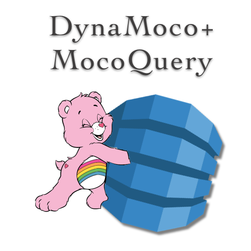

<!-- PROJECT SHIELDS -->
<!--
*** I'm using markdown "reference style" links for readability.
*** Reference links are enclosed in brackets [ ] instead of parentheses ( ).
*** See the bottom of this document for the declaration of the reference variables
*** for contributors-url, forks-url, etc. This is an optional, concise syntax you may use.
*** https://www.markdownguide.org/basic-syntax/#reference-style-links


[![Forks][forks-shield]][forks-url]
[![Stargazers][stars-shield]][stars-url]
[![LinkedIn][linkedin-shield]][linkedin-url]
[![Contributors][contributors-shield]][contributors-url]
-->

[![MIT License][license-shield]][license-url]
[![Issues][issues-shield]][issues-url]

<!-- PROJECT LOGO -->
<br />
<p align="center">
  <a href="https://github.com/othneildrew/Best-README-Template">
    
  </a>

  <h3 align="center">DynaMoco + MocoQuery</h3>

  <p align="center">
    Like a Carebear giving DyanmoDB a hug
    <br />
    <br />
    <a href="https://github.com/federalies/dynamoco/wiki/Documentation">
        <strong>Documnetation »</strong>
    </a>
    <br />
    <br />
        <a href="https://github.com/federalies/dynamoco/wiki/Documentation">
        Codepen Demo
        </a>
    <br />
    <br />
        <a href="https://github.com/federalies/dynamoco/issues">
        Report Bug
        </a>
    <br />
    <br />
        <a href="https://github.com/federalies/dynamoco/issues">
        Request Feature
        </a>
  </p>
</p>


DyanMoCo + MoCoQuery
====================

<!-- ABOUT THE PROJECT -->

[![Product Name Screen Shot][product-screenshot]](https://github.com/federalies/dynamoco)

DynamoDB is great but the way you interact with it is not really great. DynaMoco is small but mighty, wrapper that is strong enough to get what you want out of DynamoDB and gentle enough to act like bowling with bumpers on.

Writeen in Typescript it should help you with auto-complete etc - if that is of interest.

### The DynaMoco Problem 

1. The API of Dyanmo has a steep learning curve.
2. Its flexibiltiy creates too much complexity to comprehend at thge outset.
3. Dynamoco optimizes for a few use-cases that seem noramtive, making those very easy.
4. If you need to do the more complicated parts, it attempts to move out of the way.

### The DynaMoco Solution 

Use this package if:

- You need to just get going with DynamoDB
- You find the Dynamo API difficult and seemingly optimzed for AWS engineers and not it's users.
- You enjoy flexible streamlined modules.

<!-- GETTING STARTED -->

### Installation

```sh
npm install dynamoco
# or
yarn add dynamoco
```

<!-- USAGE EXAMPLES -->
## Usage

There are two independent functions that work nicely together in `dynamoco`.

The first is the gentle wrapper - `dynamoco`

The second is a nice query builder - `mocoquery`

Each of them cover some ground on the API surface area exposed by Dyanmo.

### Get Item (Full Monty)

```js
import {Dynamo} from 'aws-sdk'
import {dynamoco} from 'dynamoco'
import {credentials} from './credentials'

;(async ()=>{
    const d = new Dyanmo({credentials})
    const moco = dynamoco(d)
    // using a table that is already available
    const resutls = await moco.getItem('MyTable', {MyKey: 'SomeValue'})
    console.log(results._Item) 
        /* {    
                MyKey: 'SomeValue', 
                numberValues: 1,
                stringValues: 'strings are strings'
            } 
        */
})()
```

### Using The Query Builder

```js
import {Dynamo} from 'aws-sdk'
import {mocoquery} from 'dynamoco'
import {credentials} from './credentials'

;(async ()=>{
    const d = new Dyanmo({credentials})
    const queryParams = mocoquery('MyTable')
                        .select('*')
                        .where(['Year','>=',2020])
                        .extract()
    // using the regular Dyanmo Client 
    const regularResults = await d.query(queryParams)
    console.log('regularResults', regularResults.Items)
    
    // using the regular Dyanmo Client 
    const ezResults = await dynamoco(d).query(queryParams)
    console.log('ezResults', ezResults._Items)
})()
```

_For more examples, please refer to the [Documentation](https://github.com/federalies/dynamoco/wiki/Documentation)_


## Technical

### Single dependency

By design, this module has a single, external, run-time dependency (`aws-sdk`). And it uses a few other packages while running tests. It is a stated goal of the project to keep the dependencies as small as reasonable. _(different than as small as possible)_

#### Dependency

* [aws-sdk](https://docs.aws.amazon.com/AWSJavaScriptSDK/latest/AWS/DynamoDB.html)

### Codebase

This is a Typescript codebase, and aims to be relatively up to date with the latest version. Adopting new typescript version will likely comence after some  hardening period, but hastened if a new language feature has been added that substantially supports this project.

<!-- ROADMAP -->
## Roadmap

See the [open issues](https://github.com/federalies/dynamoco/issues) for a list of proposed features (and known issues).

<!-- CONTRIBUTING -->
## Contributing

Have a question? Ask it in an issue! We'd love to hear from you.

Contributions are what make the open source community such an amazing place to be learn, inspire, and create. Any contributions you make are **greatly appreciated**.

1. Fork the Project
2. Create your Feature Branch (`git checkout -b feature/AmazingFeature`)
3. Commit your Changes (`git commit -m 'Add some AmazingFeature'`)
4. Push to the Branch (`git push origin feature/AmazingFeature`)
5. Open a Pull Request

## Community


<!--
- Slack
- Riot
- Spectrum 
-->

See the [Community Standards and Code of Conduct](./CODE_OF_CONDUCT.md)

<!-- CONTACT -->
## Contact

Eric D Moore

 - [Email](mailto:dynaMoco@filters.email)
 - [Twitter](https://twitter.com/ericdmoore)
 - [Website](https://ericdmoore.com)
 - [Federalies](https://federali.es)


Project Link: [https://github.com/federalies/dynamoco](https://github.com/federalies/dynamoco)


<!-- ACKNOWLEDGEMENTS -->
## Acknowledgements & Credits

* [Img Shields](https://shields.io)
* [GitHub Pages](https://pages.github.com)
* https://github.com/RichardLitt/standard-readme

<!-- * [GitHub Emoji Cheat Sheet](https://www.webpagefx.com/tools/emoji-cheat-sheet) -->

<!-- MARKDOWN LINKS & IMAGES -->
<!-- https://www.markdownguide.org/basic-syntax/#reference-style-links -->
[contributors-shield]: https://img.shields.io/github/contributors/federalies/dynamoco?style=flat-square
[contributors-url]: https://github.com/federalies/dynamoco/graphs/contributors

[forks-shield]: https://img.shields.io/github/forks/federalies/dynamoco?style=flat-square
[forks-url]: https://github.com/federalies/dynamoco/network/members

[stars-shield]: https://img.shields.io/github/stars/federalies/dynamoco?style=flat-square
[stars-url]: https://github.com/federalies/dynamoco/stargazers

[issues-shield]: https://img.shields.io/github/issues/federalies/dynamoco?style=for-the-badge
[issues-url]: https://github.com/federalies/dynamoco/issues

[license-shield]: https://img.shields.io/github/license/federalies/dynamoco?style=for-the-badge
[license-url]: https://github.com/federalies/dynamoco/blob/master/LICENSE

[linkedin-shield]: https://img.shields.io/badge/-LinkedIn-black.svg?style=flat-square&logo=linkedin&colorB=555

[linkedin-url]: https://linkedin.com/in/othneildrew
[product-screenshot]: images/screenshot.png

<!-- LICENSE -->
## License

Distributed under the MIT License. See [`LICENSE`](./LICENSE) for more information.

